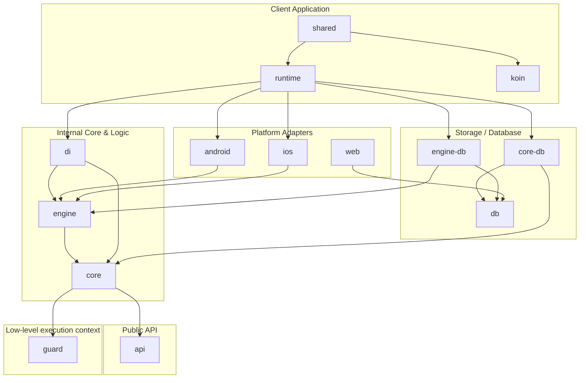

# Architecture Overview - TaskManager

This document outlines the architecture and modular structure of the **TaskManager** library, a Kotlin Multiplatform (KMP) task manager (work manager) designed for concurrent, constraint-based background work on Android, iOS, Web, and Desktop (JVM).

---

## Conventions

### Language

**All code is written in English** — comments, KDoc, exception messages, log messages, test names,
identifiers. This is an open-source library and everything in it has to be readable by people who
do not speak Czech.

Project documentation (this file, `README.md`, `development.md`) is English for the same reason.

### Comments explain *why*

The code says what happens; a comment is there for the reasoning that is not visible from it —
a platform quirk, an ordering constraint, a deliberate trade-off. Comments that restate the next
line are noise and get deleted.

### Logging

Never `println` or `printStackTrace`. Diagnostics go through `TasksLogger`, which the consuming
application plugs in at initialization; with no logger registered the library stays silent.
`TaskLifecycleObserver` is a separate seam and covers only the lifecycle of individual tasks.

---

## Core Concepts

The architecture follows a Clean Architecture design, dividing components into clear, decoupled layers of abstraction.

### 1. Guard (Execution Context & Tokens)
[guard](../guard) defines the lower-level execution environment for concurrent asynchronous work. It behaves as a multiplexer that manages background execution permissions using system constraints:
- **`Token` / `TokenProducer`**: Abstract representations of system permissions/locks. Platform-specific implementations prevent the OS from suspending the application (e.g., `WakeLock` and `ForegroundService` on Android, `UIBackgroundTask` or HealthKit observer queries on iOS).
- **`ExecutionContext`**: Represents a safe running context. Running code inside `ExecutionContext.use { ... }` ensures that if the system's background execution time limit is reached (or context expires), the coroutine scope is cancelled cleanly and resources are released.

### 2. Public API
[api](../api) is the public-facing entry point for using the TaskManager. It contains no implementation logic, only:
- Public contracts: `TaskManager`, `TaskRequest`, `TaskResult`, `TaskHandler`, `Constraints`.
- Data classes and serialization contracts: `TaskInfo`, `Tag`, `Serializer`.
- Migration helpers: `Migration`, `Migrator`.

### 3. Core Business Logic & Engine
- [core](../core) handles internal business models, task evaluations, migrations, database cleanup services, and integrates `guard`'s execution contexts.
- [engine](../engine) is the execution engine. It contains the logic to dispatch and process tasks (`TaskDispatcher`, `TaskProcessor`), track currently active tasks (`ActiveTaskTracker`), clean up abandoned tasks (`OrphanTaskSweeper`), and evaluate execution constraints (`NetworkStateConstraint`, `InitialDelayConstraint`, `ParentsConstraint`).

### 4. Database & Storage Separation
The database is structured to separate interfaces from database-specific entities using **Room** for Kotlin Multiplatform:
- [db](../db) defines the SQLite database schema (`TasksDatabase`), entities (`TaskEntity`, `TaskTagEntity`), and DAOs (`TaskDao`, `TaskResultDao`).
- [core-db](../core-db) implements the repository interfaces defined in `core` (e.g., `TaskScopeRepository`, `TaskEvaluatorRepository`) using the DAOs from `db`.
- [engine-db](../engine-db) implements the repository interfaces defined in `engine` (e.g., `TaskDispatcherRepository`, `TaskProcessorRepository`) using `db`.

### 5. Runtime / Bootstrap
- [runtime](../runtime) serves as the library's orchestrator and bootstrap layer. It exposes the public `Tasks` singleton used for initialization, handles warm-ups, and registers platform-specific observers (like network state and app background/foreground state).

---

## Migrating from an existing WorkManager setup

WorkManager stores the worker's class name in its own database, so work enqueued before the
migration still asks for the old class by name. There are two ways to deal with it.

**Let it fail (simplest).** WorkManager cannot instantiate the missing class, logs an error and
marks that work failed — it does not crash. Pick this when the scheduled work can simply be
recreated after the upgrade, which is usually the case for anything derived from local state.

**Adopt it.** Depend on `tasks-android` and declare a subclass of
`eu.tintera.background.tasks.android.TaskWorker` under the old worker's fully qualified name, then
supply `TaskManagerConfiguration.compatTransformation` so the old input data can be read. See the
KDoc on `TaskWorker` for the details.

The library deliberately ships no such subclass itself: the class name belongs to *your* previous
setup, not to the library.

---

## Complete Module Guide

| Module Name | Purpose & Responsibilities | Key Components |
| :--- | :--- | :--- |
| **`guard`** | Lower-level execution token multiplexer. Handles OS-level background locks. | `ExecutionContext`, `TokenProducer`, `WakeLockTokenProducer`, `UiBackgroundTaskTokenProducer` |
| **`api`** | Public APIs for scheduling and handling tasks. | `TaskManager`, `TaskHandler`, `TaskRequest`, `TaskResult` |
| **`core`** | Domain business logic, repository definitions, guard integration. | `TaskEvaluator`, `TaskMigrator`, `GuardInit` |
| **`engine`** | Task scheduling, lifecycle management, and constraint evaluation. | `TaskDispatcher`, `TaskProcessor`, `ConstraintController` |
| **`db`** | Database schema, Room DAOs, and entities. | `TasksDatabase`, `TaskDao`, `TaskEntity` |
| **`core-db`** | Bridge: Implements `core` repositories using `db`. | `TaskEvaluatorRepositoryImpl`, `TaskScopeRepositoryImpl` |
| **`engine-db`** | Bridge: Implements `engine` repositories using `db`. | `TaskDispatcherRepositoryImpl`, `TaskProcessorRepositoryImpl` |
| **`runtime`** | Bootstrapper, platform-specific observers, library initialization. | `Tasks`, `TasksInitializer`, `JvmAppStateObserver`, `WebAppStateObserver` |
| **`di`** | Internal dependency injection wrapper encapsulating Koin. | `TasksKoinContext`, `TasksKoinComponent` |
| **`compat`** | Compatibility layer for migrating from an untyped, map-shaped payload. | `Data`, `LegacyTaskHandler`, `TaskRequest.LegacyExt` |
| **`android` / `android-db`** | Android integration using system WorkManager. | `WorkManagerTaskManager`, `TaskWorker` |
| **`ios` / `ios-db`** | iOS BGTask Scheduler and background processing integration. | `BgTaskManager`, `BgProcessingTaskManager`, `AppRefreshTaskManager` |
| **`web`** | SQLite WASM worker driver integration for web browser DB support. | `SQLiteWasmWorker`, `SQLiteDriver` |
| **`koin-*`** | Client-facing Koin integration utilities for registering tasks. | `TaskRegistration`, `taskHandlerOf` |
| **`serialization-*`** | Serialization formats supported (JSON, Protobuf). | `JsonSerializer` |
| **`shared`** | Compose Multiplatform demo app UI and common demo handlers. | `App`, `MainViewModel`, `TestHandler` |
| **`*App`** | Platform-specific entry point apps (`androidApp`, `iosApp`, etc.). | Platform-specific launcher files |
