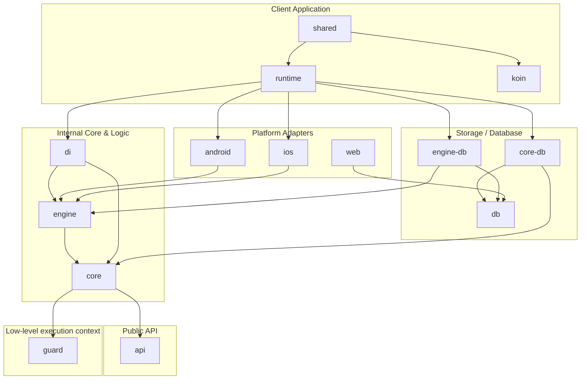

# Architecture Overview - TaskManager

This document outlines the architecture and modular structure of the **TaskManager** library, a Kotlin Multiplatform (KMP) task manager (work manager) designed for concurrent, constraint-based background work on Android, iOS, Web, and Desktop (JVM).

---

## Conventions

### Language

**All code is written in English** — comments, KDoc, exception messages, log messages, test names,
identifiers. This is an open-source library and everything in it has to be readable by people who
do not speak Czech.

Project documentation (this file, `README.md`, `development.md`) is English for the same reason.

### Comments explain *why*

The code says what happens; a comment is there for the reasoning that is not visible from it —
a platform quirk, an ordering constraint, a deliberate trade-off. Comments that restate the next
line are noise and get deleted.

### Logging

Never `println` or `printStackTrace`. Diagnostics go through `TasksLogger`, which the consuming
application plugs in at initialization; with no logger registered the library stays silent.
`TaskLifecycleObserver` is a separate seam and covers only the lifecycle of individual tasks.

---

## Philosophy

Two layers with two different jobs. Keeping them apart is the point of the whole design.

### `guard` — get the most out of what the OS allows

Guard is not a safety net and it makes no promises about work finishing. It is an *ensuring*
environment: it tries to give the application as much room to run as the operating system is willing
to grant, and it respects the limits the moment they are reached.

- **Every OS permission is a `Token`**, produced by a `TokenProducer` — `WakeLock` and
  `ForegroundService` on Android, `UIBackgroundTask`, a BGTask window or a HealthKit observer query
  on iOS. A consumer never names a producer; it just asks for an `ExecutionContext`.
- **It multiplexes.** Concurrent consumers share a single session: the system resource is taken on
  the first `acquire()` and released only after the last consumer leaves, plus a debounce. Twenty
  short operations cost one `beginBackgroundTask`, not twenty.
- **It squeezes.** All available producers contribute to the same session, so an allowance that
  arrives while work is already running simply extends it. The session ends when the *last* token is
  gone, not the first.
- **It hands over without a gap.** `autoReleasePrevious` emits the new token and waits for it to be
  accepted before releasing the old one, so work started in the foreground picks up a background
  allowance when the user backgrounds the app — no window in which the process is unprotected.
- **When everything really is exhausted, it degrades gracefully.** `ExecutionContext.isExpired`
  fires and `use { }` cancels the scope, so work stops deliberately instead of being cut in half by
  the system.
- **It is pluggable.** Any consumer can register its own `TokenProducer` (`registerProducer`) and
  observe tokens that are waiting to be picked up (`pendingToken`). That is how a HealthKit observer
  query becomes an allowance rather than a special case in application code.

Guard persists nothing and decides nothing about *what* runs. It answers exactly one question: may
we work right now, and for how long.

### `tasks` — make sure the work eventually happens

The task manager sits on top and adds what guard deliberately lacks: persistence, scheduling,
constraints, retries, payload versioning. Where guard says *you may work now*, the task manager says
*this has to happen at some point, without fighting the system*.

It is guard's first consumer, not its owner. It registers its own producers (the BGTask window on
iOS) and otherwise uses the same API any other consumer would.

### Which one to reach for

**Use the task manager** when the work has to survive the process — uploads, synchronization,
anything a user would notice missing after a restart.

**Use guard directly** for cohesive, application-initiated operations that run while the app is
alive and should not be torn in half if the user backgrounds it halfway through — typically
ViewModel-level operations. In the foreground `acquire()` is effectively free (the foreground token
is a no-op), and the hand-over above keeps the operation alive across the transition.

**Do not wrap every individual database write.** `acquire()` may wait when the app is already in the
background and its background allowance is spent — the right behaviour for a scheduler waiting for
its window, counterproductive on a write path, where waiting means the data you wanted to protect
sits unwritten. Guard the whole operation, not each statement.

---

## Core Concepts

The architecture follows a Clean Architecture design, dividing components into clear, decoupled layers of abstraction.



### 1. Guard (Execution Context & Tokens)
[guard](../guard) defines the lower-level execution environment for concurrent asynchronous work. It behaves as a multiplexer that manages background execution permissions using system constraints (see [Philosophy](#philosophy) for what it does and does not promise):
- **`Token` / `TokenProducer`**: Abstract representations of system permissions/locks. Platform-specific implementations prevent the OS from suspending the application (e.g., `WakeLock` and `ForegroundService` on Android, `UIBackgroundTask` or HealthKit observer queries on iOS).
- **`ExecutionContext`**: Represents a safe running context. Running code inside `ExecutionContext.use { ... }` ensures that if the system's background execution time limit is reached (or context expires), the coroutine scope is cancelled cleanly and resources are released.

### 2. Public API
[api](../tasks/api) is the public-facing entry point for using the TaskManager. It contains no implementation logic, only:
- Public contracts: `TaskManager`, `TaskRequest`, `TaskResult`, `TaskHandler`, `Constraints`.
- Data classes and serialization contracts: `TaskInfo`, `Tag`, `Serializer`.
- Migration helpers: `Migration`, `Migrator`.

### 3. Core Business Logic & Engine
- [core](../tasks/core/core) handles internal business models, task evaluations, migrations, database cleanup services, and integrates `guard`'s execution contexts.
- [engine](../tasks/engine/engine) is the execution engine. It contains the logic to dispatch and process tasks (`TaskDispatcher`, `TaskProcessor`), track currently active tasks (`ActiveTaskTracker`), clean up abandoned tasks (`OrphanTaskSweeper`), and evaluate execution constraints (`NetworkStateConstraint`, `InitialDelayConstraint`, `ParentsConstraint`).

### 4. Database & Storage Separation
The database is structured to separate interfaces from database-specific entities using **Room** for Kotlin Multiplatform:
- [db](../tasks/db) defines the SQLite database schema (`TasksDatabase`), entities (`TaskEntity`, `TaskTagEntity`), and DAOs (`TaskDao`, `TaskResultDao`).
- [core-db](../tasks/core/db) implements the repository interfaces defined in `core` (e.g., `TaskScopeRepository`, `TaskEvaluatorRepository`) using the DAOs from `db`.
- [engine-db](../tasks/engine/db) implements the repository interfaces defined in `engine` (e.g., `TaskDispatcherRepository`, `TaskProcessorRepository`) using `db`.

### 5. Runtime / Bootstrap
- [runtime](../tasks/runtime) serves as the library's orchestrator and bootstrap layer. It exposes the public `Tasks` singleton used for initialization, handles warm-ups, and registers platform-specific observers (like network state and app background/foreground state).

**Initialization is always explicit**, on every platform:

```kotlin
TasksInitializer.initialize(
    configuration = TaskManagerConfiguration(…),
    taskLifecycleObservers = …,
    loggers = …,
)
```

There is deliberately no Android auto-start through `androidx.startup`. It looks convenient, but it
runs from a `ContentProvider` — before `Application.onCreate` — and initialization is
first-one-wins, so an application configuring the library in `onCreate` would have its
configuration **silently discarded**, loggers and lifecycle observers included. Opting out meant a
`tools:node="remove"` entry that is easy to get wrong and impossible to verify. iOS needs explicit
identifiers anyway, so explicit initialization is also the one story that holds on every platform.

A worker started by the system before the application initialized does not fail: `TaskWorker`
suspends until initialization happens (see `TasksKoinContext.awaitKoinApp`).

---

## Migrating from an existing WorkManager setup

WorkManager stores the worker's class name in its own database, so work enqueued before the
migration still asks for the old class by name. There are two ways to deal with it.

**Let it fail (simplest).** WorkManager cannot instantiate the missing class, logs an error and
marks that work failed — it does not crash. Pick this when the scheduled work can simply be
recreated after the upgrade, which is usually the case for anything derived from local state.

**Adopt it.** Depend on `tasks-android` and declare a subclass of
`eu.tintera.background.tasks.android.TaskWorker` under the old worker's fully qualified name, then
supply `TaskManagerConfiguration.compatTransformation` so the old input data can be read. See the
KDoc on `TaskWorker` for the details.

The library deliberately ships no such subclass itself: the class name belongs to *your* previous
setup, not to the library.

---

## Complete Module Guide

| Module Name | Purpose & Responsibilities | Key Components |
| :--- | :--- | :--- |
| **`guard`** | Lower-level execution token multiplexer. Handles OS-level background locks. | `ExecutionContext`, `TokenProducer`, `WakeLockTokenProducer`, `UiBackgroundTaskTokenProducer` |
| **`api`** | Public APIs for scheduling and handling tasks. | `TaskManager`, `TaskHandler`, `TaskRequest`, `TaskResult` |
| **`core`** | Domain business logic, repository definitions, guard integration. | `TaskEvaluator`, `TaskMigrator`, `GuardInit` |
| **`engine`** | Task scheduling, lifecycle management, and constraint evaluation. | `TaskDispatcher`, `TaskProcessor`, `ConstraintController` |
| **`db`** | Database schema, Room DAOs, and entities. | `TasksDatabase`, `TaskDao`, `TaskEntity` |
| **`core-db`** | Bridge: Implements `core` repositories using `db`. | `TaskEvaluatorRepositoryImpl`, `TaskScopeRepositoryImpl` |
| **`engine-db`** | Bridge: Implements `engine` repositories using `db`. | `TaskDispatcherRepositoryImpl`, `TaskProcessorRepositoryImpl` |
| **`runtime`** | Bootstrapper, platform-specific observers, library initialization. | `Tasks`, `TasksInitializer`, `JvmAppStateObserver`, `WebAppStateObserver` |
| **`di`** | Internal dependency injection wrapper encapsulating Koin. | `TasksKoinContext`, `TasksKoinComponent` |
| **`compat`** | Compatibility layer for migrating from an untyped, map-shaped payload. | `Data`, `DataTaskHandler`, `DataTaskScope` |
| **`android` / `android-db`** | Android integration using system WorkManager. | `WorkManagerTaskManager`, `TaskWorker` |
| **`ios` / `ios-db`** | iOS BGTask Scheduler and background processing integration. | `BgTaskManager`, `BgProcessingTaskManager`, `AppRefreshTaskManager` |
| **`web`** | SQLite WASM worker driver integration for web browser DB support. | `SQLiteWasmWorker`, `SQLiteDriver` |
| **`koin-*`** | Client-facing Koin integration utilities for registering tasks. | `TaskRegistration`, `taskHandlerOf` |
| **`serialization-*`** | Serialization formats supported (JSON, Protobuf, `compat` Data). | `jsonSerializer`, `protobufSerializer`, `dataSerializer` |
| **`shared`** | Compose Multiplatform demo app UI and common demo handlers. | `App`, `MainViewModel`, `TestHandler` |
| **`*App`** | Platform-specific entry point apps (`androidApp`, `iosApp`, etc.). | Platform-specific launcher files |
